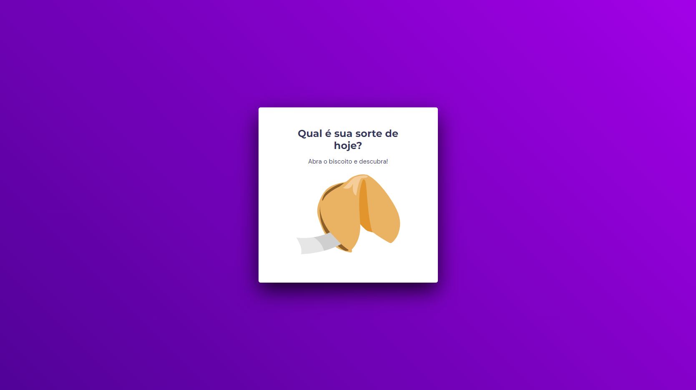

# Desafio - Biscoito da Sorte

> Explorer Stage 05 da Rocketseat

## 📝 Descrição
Projeto desenvolvido no curso Explorer da Rocketseat. 

A proposta era criar um jogo chamado Biscoito da Sorte, onde o biscoito seria aberto e apresentaria uma mensagem.

Conteúdo passado em aula que foi utilizado:
- Estrutura de dados HTML
- Animações com CSS
- Funções no Javascript
- Manipulação da DOM
- Biblioteca JS Math()
- Funções *callback*
- Arrays

🔗 [Acesse aqui](https://daniyuk.github.io/biscoito-da-sorte/)

## 💻 Tecnologias 
- HTML
- CSS
- JavaScript

## ✨Exemplo da animação

